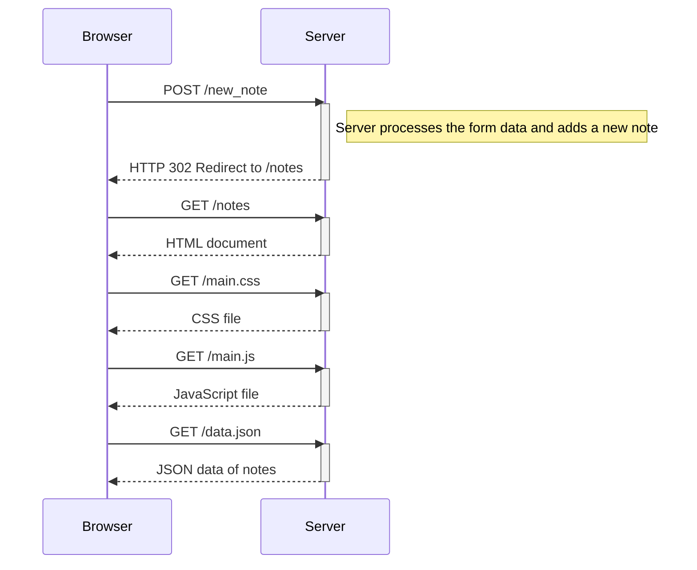

```mermaid
sequenceDiagram
    participant Browser
    participant Server

    Browser->>Server: POST /new_note
    activate Server
    Note right of Server: Server processes the form data and adds a new note
    Server-->>Browser: HTTP 302 Redirect to /notes
    deactivate Server

    Browser->>Server: GET /notes
    activate Server
    Server-->>Browser: HTML document
    deactivate Server

    Browser->>Server: GET /main.css
    activate Server
    Server-->>Browser: CSS file
    deactivate Server

    Browser->>Server: GET /main.js
    activate Server
    Server-->>Browser: JavaScript file
    deactivate Server

    Browser->>Server: GET /data.json
    activate Server
    Server-->>Browser: JSON data of notes
    deactivate Server

```
