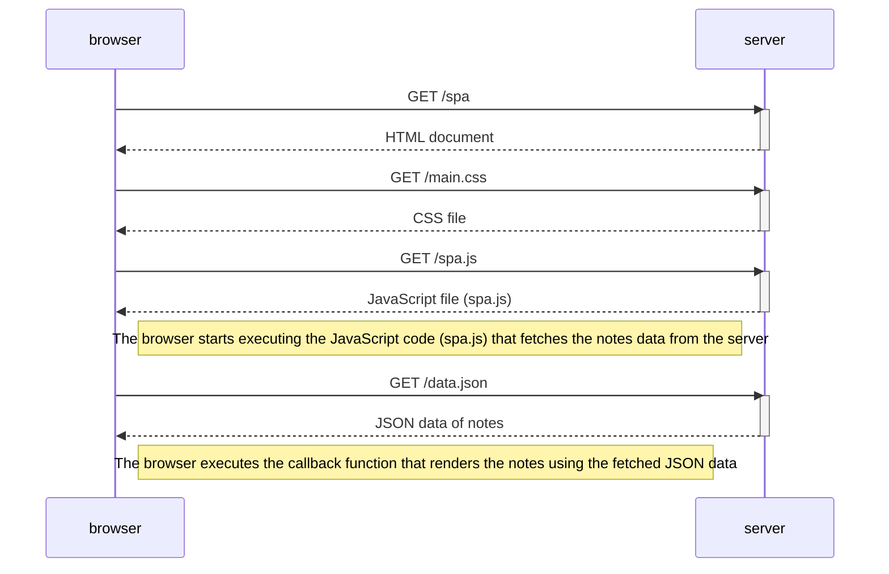

```mermaid
  sequenceDiagram
    participant browser
    participant server

    browser->>server: GET /spa
    activate server
    server-->>browser: HTML document
    deactivate server

    browser->>server: GET /main.css
    activate server
    server-->>browser: CSS file
    deactivate server

    browser->>server: GET /spa.js
    activate server
    server-->>browser: JavaScript file (spa.js)
    deactivate server

    Note right of browser: The browser starts executing the JavaScript code (spa.js) that fetches the notes data from the server

    browser->>server: GET /data.json
    activate server
    server-->>browser: JSON data of notes
    deactivate server

    Note right of browser: The browser executes the callback function that renders the notes using the fetched JSON data
```
