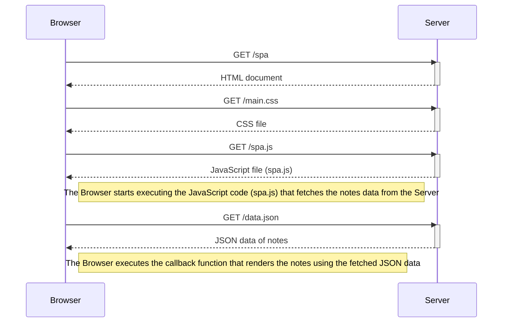

```mermaid
  sequenceDiagram
    participant Browser
    participant Server

    Browser->>Server: GET /spa
    activate Server
    Server-->>Browser: HTML document
    deactivate Server

    Browser->>Server: GET /main.css
    activate Server
    Server-->>Browser: CSS file
    deactivate Server

    Browser->>Server: GET /spa.js
    activate Server
    Server-->>Browser: JavaScript file (spa.js)
    deactivate Server

    Note right of Browser: The Browser starts executing the JavaScript code (spa.js) that fetches the notes data from the Server

    Browser->>Server: GET /data.json
    activate Server
    Server-->>Browser: JSON data of notes
    deactivate Server

    Note right of Browser: The Browser executes the callback function that renders the notes using the fetched JSON data
```
