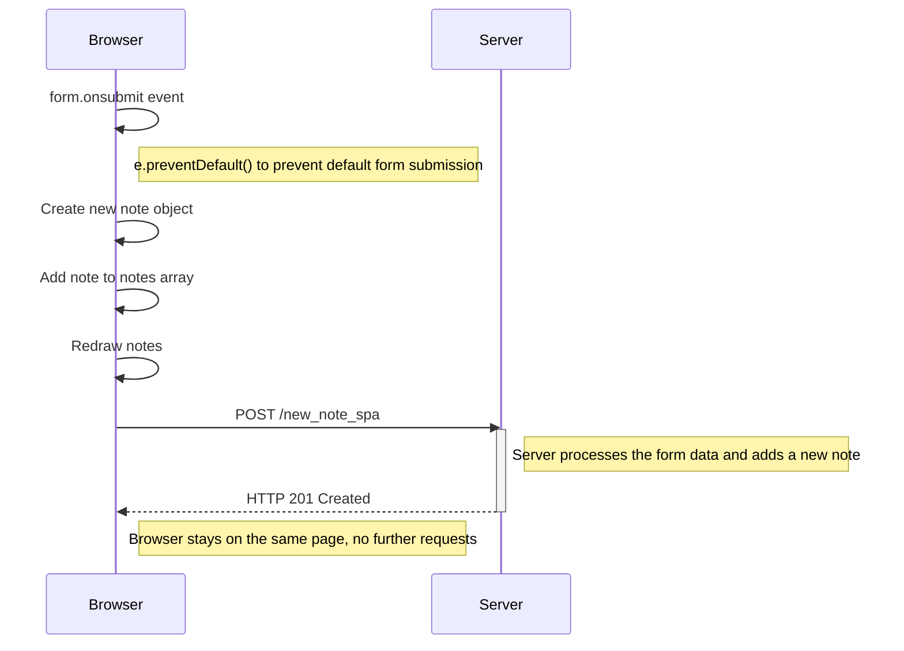

```mermaid
  sequenceDiagram
    participant Browser
    participant Server

    Browser->>Browser: form.onsubmit event
    Note right of Browser: e.preventDefault() to prevent default form submission
    Browser->>Browser: Create new note object
    Browser->>Browser: Add note to notes array
    Browser->>Browser: Redraw notes

    Browser->>Server: POST /new_note_spa
    activate Server
    Note right of Server: Server processes the form data and adds a new note
    Server-->>Browser: HTTP 201 Created
    deactivate Server

    Note right of Browser: Browser stays on the same page, no further requests

```
